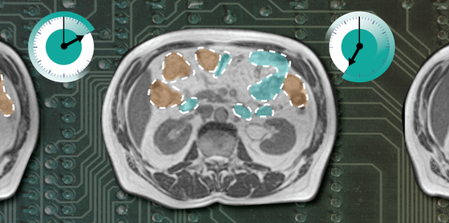
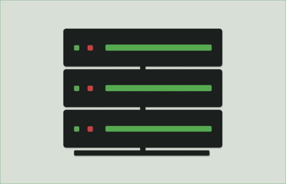

## Projects

---
[Data Analysis Tool](https://github.com/sashanktalakola/visualization-tool/)

*   Developed a data analysis tool, for quick exploratory data analysis tasks using the Streamlit framework
*   Features an intuitive user interface for easy navigation and supports various data visualization techniques for insightful analysis
*   Provides a user-friendly environment for both novice and experienced users in data analysis

---
[GI-Tract Image Segmentation](https://www.kaggle.com/code/sashanktalakola/gi-tract-image-segmentation)

*   Developed a new Deep Learning-based Segmentation Model leveraging geometric features learned from data
*   Achieved a test score of 0.86194 on test data using the final methodology, based on a weighted average of the Dice coefficient and 3D Hausdorff loss
*   Surpassed several state-of-the-art models, including UNet with various encoders

---
[RSNA Cancer Imaging](https://github.com/sashanktalakola/rsna-cancer-detection)
*   Leveraged a novel approach in cancer image classification by integrating multiple sources of image data, enabling a more comprehensive analysis and enhancing model performance.
*   Achieved Bronze Medal in Kaggle competition by demonstrating proficiency in the field by securing a commendable ranking in a highly competitive environment, showcasing the effectiveness of the developed solution.
*   Made code improvements leveraging CUDA performance for efficient computation in cases of CPU bottlenecks

---
Home Lab

*   NGINX served as a powerful reverse proxy, efficiently managing incoming requests, terminating SSL connections, and balancing traffic across various services, enhancing security and performance.
*   Docker and Kubernetes orchestration facilitated the seamless deployment and scaling of personalized Streaming, Blog, Cloud Storage, File Sharing and a few other services, ensuring efficient resource utilization and easy management of containerized applications
*   Monitoring solutions like Uptime Kuma provided comprehensive visibility into system health, resource usage, and service availability, enabling proactive maintenance and optimization to ensure uninterrupted operation of the homelab environment

---
[Blog Website](https://bytecrafts.sashanktalakola.com)
*   Created a blog website using the Astro framework, leveraging its static site generation capabilities for optimal performance and speed.
*   Employed Docker for containerizing the application, ensuring consistent deployment across different environments and simplifying the development workflow
*   Utilized Google Cloud Platform (GCP) for deploying the application, taking advantage of its scalable infrastructure and robust services for reliable hosting and management
---